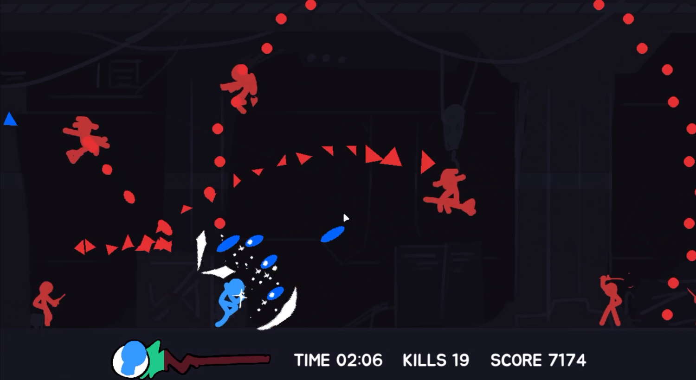

# 🗡️ Deflect
- [Original Project Proposal V4](other\Project_Proposal_v4.pdf)
- [Presentation Video](https://youtu.be/6RRtU3iS4Ks)
## 🎮 Overview
_Deflect_ is a fast-paced 2D side-scrolling survival game where players can't directly attack — instead, they must **deflect** enemy attacks to damage them. 

**Your defense is your only offense.**

## ⚙️ Core Mechanics
- **Deflect**: Return the enemies's attack by slashing them.
- **Dodge**: Dash forward and avoid every attacks in the way.
- **Double Jump**: Perform another jump in the air.
- **Passive Healing**: Stay out of the fight and recover.
- **Endless**: Survive for as long as you can!

## UML
Check out the [*pdf version*](other\UML.pdf) for higher resolution.

