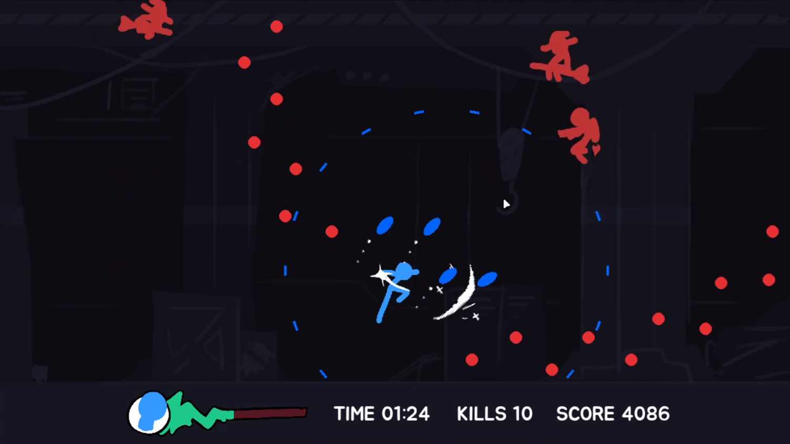

# 🗡️ Deflect

**A 2D action survival game where defense is your only offense.**  
By Chetphisuth Tongpa (ID: 6710545491)

## 🎮 Game Overview

_Deflect_ is a fast-paced 2D side-scrolling survival game where players can't directly attack — instead, they must **deflect** enemy attacks to damage them.



## ⚙️ Core Mechanics

- **Deflect**: Return the enemies's attack by slashing them.
- **Dodge**: Dash forward and avoid every attacks in the way.
- **Double Jump**: Perform a jump once in the air.
- **Endless**: Survive for as long as you can!

## 🕹️ Controls

| Action        | Key/Mouse         |
|---------------|-------------------|
| Move Left     | `A`               |
| Move Right    | `D`               |
| Jump / Double Jump | `W` or `SPACE` |
| Dodge (Aim with mouse) | `SHIFT`           |
| Deflect (Aim with mouse) | `Left Mouse Click`|

## 🔧 Installation

Follow these steps to set up and run the game locally:

1.  **Prerequisites:**
    *   Ensure you have Python 3.7 or later installed. You can download it from [python.org](https://www.python.org/).
    *   Ensure you have `pip` (Python's package installer) available. It usually comes with Python.
    *   Note that the game is developed **on Windows**, so macOS users might potentailly have some side effects.

2.  **Clone the Repository:**
    Clone the project repository to your local machine:
    ```bash
    git clone https://github.com/Keenlol/deflect.git
    cd deflect
    ```

3.  **Install Dependencies:**
    Install the required Python libraries using pip and the `requirements.txt` file:
    ```bash
    pip install -r requirements.txt
    ```

4.  **Run the Game:**
    Execute the main game script:
    ```bash
    python game.py
    ```

The game window should now open and you can start playing.

## 🎯 To-do list

- [x] Implement basic Pygame setup.
- [x] Player assets.
- [x] Player controls.
- [x] Enemy 1 assets.
- [x] Enemy 1 mechanics.
- [x] Deflection mechanics
- [x] Enemy 2 assets.
- [x] Enemy 2 mechanics.
- [x] Enemy 3 assets.
- [x] Enemy 3 mechanics.
- [x] Implement the new timer system for Player and Game.
- [ ] Implement the new timer system for enemy.
- [ ] Improve the code for everything.
- [ ] Balance Enemy and Players, refine spawning and scoring.
- [ ] Statistic tracking and visualization.
- [ ] Sound effects.
- [ ] Main menu and extra UIs.


## 📎 Links
- [Full Project Proposal V4](https://docs.google.com/document/d/1NTz00DZZyBh48hizPht9d8jJEmeq7qE31ddM4IOAoks/edit?usp=sharing)

---

> 💡 This is a student project made for educational purposes.

